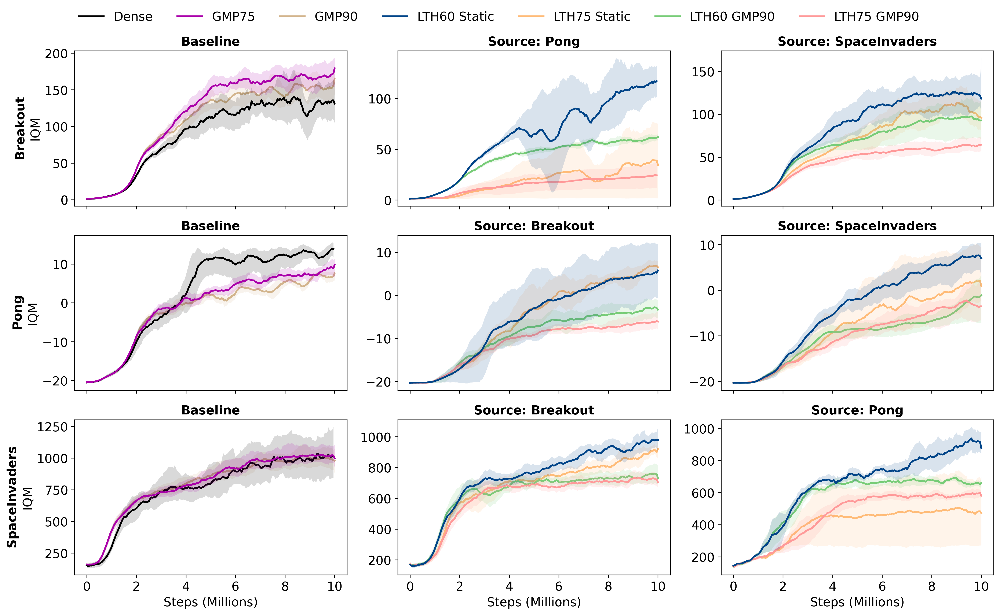

# Transferability of Sparse Subnetworks in Reinforcement Learning

This repository contains the code and resources for the research project "Transferability of Sparse Subnetworks in Value-Based Deep Reinforcement Learning".

> [!NOTE]
> For a full detailed analysis and results, please refer to the **[Project Report](./report.pdf)**.

## Overview

Sparse subnetworks such as lottery tickets can match or outperform dense performance in supervised learning, but it remains unclear whether such sparsified representations transfer across reinforcement learning (RL) tasks. We study the transferability of pruned subnetworks in value-based deep reinforcement learning by training Double Deep Q-Network (DDQN) agents on Atari environments and transferring sparse encoders between tasks.

We compare subnetworks obtained via **Lottery Ticket Hypothesis (LTH)** pruning and **Gradual Magnitude Pruning (GMP)**, and evaluate two target task adaptation regimes:
1.  **Static transfer**: No further pruning.
2.  **Continued magnitude pruning**: Pruning during target training to restore plasticity.

Across Pong, Breakout, and Space Invaders, we find that while winning tickets can exist within individual tasks, transferring sparse subnetworks across games yields limited or negative transfer relative to training from scratch, and reintroducing pruning during target task training further degrades performance compared to Static transfer. These results suggest that magnitude-based sparsity alone does not mitigate the representation-value misalignment that arises during cross-task transfer in DDQN, and that effective RL transfer requires mechanisms that preserve or re-establish encoder-head co-adaptation rather than solely relying on sparsity.

## Project Structure

The repository is organized as follows:

- **`src/rlp`**: Core Python package containing the implementation of DDQN agents, pruning algorithms, and training loops.
    - `pruning/`: Implementations of LTH and GMP pruning strategies.
    - `agent/`: DDQN agent architecture and logic.
    - `env/`: Atari environment wrappers and factories.
    - `core/`: Training infra, including the Trainer and persistent state management.
- **`scripts/`**: Utilities for data analysis and plotting.
    - `generate_area_ratio/`: Scripts to calculate transfer performance metrics (IQM area ratios).
    - `plot_winning_tickets/`: Plotting scripts for visualizing LTH and transfer results.
    - `compare_runs/`: Tools to compare different experimental runs.
- **`configs/`**: Configuration files (likely Hydra/OmegaConf) for defining experimental parameters.
- **`dispatcher/`**: Scripts for orchestrating experiments (e.g., SLURM batch scripts, dispatchers).
- **`report.pdf`**: The final report document detailing the methodology, experiments, and conclusions.
