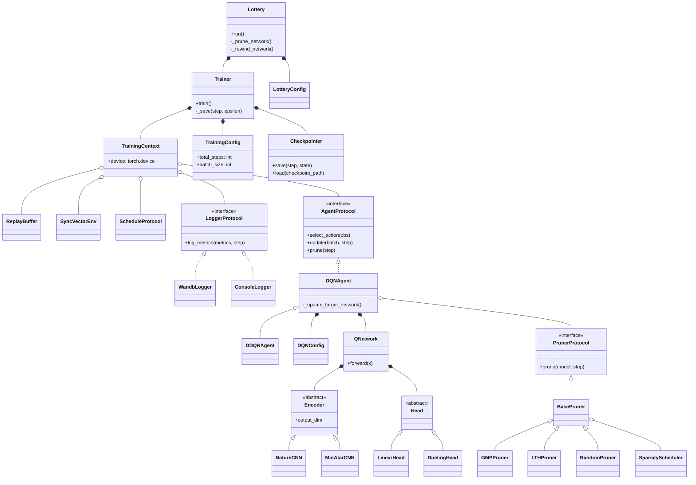

# RLP-25 Class Diagram

```mermaid
classDiagram
    %% Core System
    class Trainer {
        +train()
        -_save(step, epsilon)
    }
    class TrainingContext {
        +device: torch.device
    }
    class TrainingConfig {
        +total_steps: int
        +batch_size: int
    }
    class Checkpointer {
        +save(step, state)
        +load(checkpoint_path)
    }
    class ReplayBuffer
    class SyncVectorEnv
    class ScheduleProtocol

    Trainer *-- TrainingContext
    Trainer *-- TrainingConfig
    Trainer *-- Checkpointer

    TrainingContext o-- AgentProtocol
    TrainingContext o-- ReplayBuffer
    TrainingContext o-- LoggerProtocol
    TrainingContext o-- ScheduleProtocol
    TrainingContext o-- SyncVectorEnv

    %% Logging
    class LoggerProtocol {
        <<interface>>
        +log_metrics(metrics, step)
    }
    class WandbLogger
    class ConsoleLogger
    LoggerProtocol <|.. WandbLogger
    LoggerProtocol <|.. ConsoleLogger

    %% Agents
    class AgentProtocol {
        <<interface>>
        +select_action(obs)
        +update(batch, step)
        +prune(step)
    }
    class DQNAgent {
        -_update_target_network()
    }
    class DDQNAgent
    class DQNConfig

    AgentProtocol <|.. DQNAgent
    DQNAgent <|-- DDQNAgent
    DQNAgent *-- DQNConfig
    DQNAgent *-- QNetwork
    DQNAgent o-- PrunerProtocol

    %% Network Components
    class QNetwork {
        +forward(x)
    }
    class Encoder {
        <<abstract>>
        +output_dim
    }
    class Head {
        <<abstract>>
    }
    class NatureCNN
    class MinAtarCNN
    class LinearHead
    class DuelingHead

    QNetwork *-- Encoder
    QNetwork *-- Head
    Encoder <|-- NatureCNN
    Encoder <|-- MinAtarCNN
    Head <|-- LinearHead
    Head <|-- DuelingHead

    %% Pruning System
    class PrunerProtocol {
        <<interface>>
        +prune(model, step)
    }
    class BasePruner
    class GMPPruner
    class LTHPruner
    class RandomPruner
    class SparsityScheduler

    PrunerProtocol <|.. BasePruner
    BasePruner <|-- GMPPruner
    BasePruner <|-- LTHPruner
    BasePruner <|-- RandomPruner
    BasePruner o-- SparsityScheduler

    %% Lottery Ticket Hypothesis
    class Lottery {
        +run()
        -_prune_network()
        -_rewind_network()
    }
    class LotteryConfig

    Lottery *-- Trainer
    Lottery *-- LotteryConfig
```
